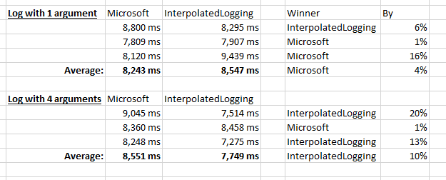

# Interpolated Logging

**Extensions to Logging Libraries to write Log Messages using Interpolated Strings without losing Structured Property Names** 

## Introduction

Most logging libraries support **structured logging**:

```cs
logger.Info("User {UserName} created Order {OrderId} at {Date}, operation took {OperationElapsedTime}ms", 
    name, orderId, DateTime.Now, elapsedTime);
```

This means that our logs will get not only plain strings but also the structured data, allowing us to search for specific property values (e.g. search for `OrderId="123"` to trace some order, or search for `OperationElapsedTime>1000` to find slow operations).  

The problem with this approach is that it's easy to put the wrong number of parameters or wrong order of parameters (the parameters at the end are **positional**, they are not matched with the message by their names).

If we just used regular interpolated strings we would lose the benefit of structured logging, since the logging library won't know the names of each property.

## How it works

Our extension methods solve this problem by extending popular logging libraries with extension methods that allow the use of interpolated strings while still being able to define the name of the properties:

**Syntax 1: Colon-syntax:**
```cs
// Define property names after the variables using colon-syntax ( {variable:propertyName} )
logger.InterpolatedInfo($"User {name:UserName} created Order {orderId:OrderId} at {now:Date}, operation took {elapsedTime:OperationElapsedTime}ms");
```

**Syntax 2: NP-syntax:**
```cs
// Define property names using explicit NP (NamedProperty) helper
logger.InterpolatedInfo($"User {NP(name, "UserName")} created Order {NP(orderId, "OrderId")} at {NP(now, "Date")}, operation took {NP(elapsedTime, "OperationElapsedTime")}ms");
```
**Syntax 3: Anonymous-objects:**
```cs
// Define property names using anonymous objects
logger.InterpolatedInfo($"User {new { UserName = name }} created Order {new { OrderId = orderId}} at {new { Date = now }}, operation took {new { OperationElapsedTime = elapsedTime }}ms");
```

All those 3 syntaxes above are equivalent (and have near identical performance), so pick the one you like better. 
(I think colon-syntax is the most concise and easy to remember, but NP-syntax might be better if you want your property names to refer to existing constants or to use `nameof`).

The result is that your logging library will be invoked with this template and these properties below:

```cs
"User {UserName} created Order {OrderId} at {Date}, operation took {OperationElapsedTime}ms"
// ... and the properties in order: name, orderId, DateTime.Now, elapsedTime.
```

## Why can't I just use regular string interpolation?

If you were just using regular string interpolation (without our extension methods) the final rendered log (plain message) tracked in your logging library would be the same, but the received template would be  
different for each log entry (template identical to the rendered message), and the properties would be tracked without meaningful names - they would be like `{0}="Rick"`, `{1}=1001`, etc.  
This causes two problems:
- You can't group your logs by the template, since each log will have a different template
- You can't search in your logging database for something like `WHERE UserName=="Rick"`. The best you could do would be like `WHERE Message LIKE "User * created Order * at *" AND Props.{0}="Rick"` - but structured logging can do much better than this.

# Quickstart

1. Install the **NuGet package** according to your logging library ([Serilog](https://www.nuget.org/packages/InterpolatedLogging.Serilog), [Microsoft.Extensions.Logging](https://www.nuget.org/packages/InterpolatedLogging.Microsoft.Extensions.Logging/) or [NLog](https://www.nuget.org/packages/InterpolatedLogging.NLog/))
1. Start using like this:

```cs
// for easier usage our extension methods use the same namespace of the logging libraries
// using Serilog;
// or using Microsoft.Extensions.Logging;
// or using NLog;
using static InterpolatedLogging.NamedProperties; // for using the short NP helper you need this
// ...

logger.InterpolatedInformation($"User {name:UserName} created Order {orderId:OrderId} at {now:Date}, operation took {elapsedTime:OperationElapsedTime}ms");
// there are also extensions for Debug, Verbose (or Trace depending on your logging library), etc, and there are also overloads that take an Exception.
```

# Supported Logging Libraries

Current supported libraries:

Library | Status | NuGet Package
------------ | ------------- | -------------
**Serilog** | Working | [NuGet](https://www.nuget.org/packages/InterpolatedLogging.Serilog/)
**Microsoft.Extensions.Logging** | Working | [NuGet](https://www.nuget.org/packages/InterpolatedLogging.Microsoft.Extensions.Logging/)
**NLog** | Working | [NuGet](https://www.nuget.org/packages/InterpolatedLogging.NLog/)
log4net | Pending |


# Advanced Features

## Raw strings

If you want to embed raw strings in your messages (don't want them to be saved as structured properties), you don't need to create an anonymous object and you can just use the **raw modifier**:

```cs
logger.InterpolatedInformation($"User {new { UserName = name }} logged as {role:raw}");
```

## Destructuring operator

Serilog and NLog supports the `@` destructuring operator which makes a single property be stored with its internal structure (instead of just invoking `ToString()` and saving the serialized property).

```cs
var input = new { Latitude = 25, Longitude = 134 };

// colon-syntax:
logger.Information($"Processed {input:@SensorInput}.");

// NP-syntax:
logger.Information($"Processed {NP(input, "@SensorInput")}.");

// or anonymous object syntax (put the @ before the interpolated block, since @ is not allowed in identifiers)
logger.Information($"Processed @{ new { SensorInput = input }}.");

// in plain Serilog this would be equivalent of:
//logger.Information("Processed {@SensorInput}.", input);
```

## Format specifiers

You can obviously pre-format your objects and log them as formatted strings. 
But if you want to pass the original object and yet define some specific format for it during the message rendering you can specify format specifier as you would regularly do in an interpolated string:

```cs
int time = 15; // 15 milliseconds

// colon-syntax (property name comes first! then another colon and the format specifier):
logger.Information($"Processed order in {time:TimeMS:000} ms.");

// NP-syntax:
logger.Information($"Processed order in {NP(time, "TimeMS"):000} ms.");

// or anonymous object syntax
logger.Information($"Processed order in { new { TimeMS = time}:000} ms.");

// in plain Serilog this would be equivalent of:
//logger.Information("Processed order in {TimeMS:000}ms.", input, time);
```

# Performance / Benchmarks 

Some people are worried that using FormattableString is much slower than using the regular strings. And some have mentioned that Microsoft is working on a [proposal](https://github.com/dotnet/designs/pull/195) for a [Logging Generator](https://github.com/geeknoid/LoggingGenerator) 
which uses C# 9 source generators and which should convert decorated partial-methods into strongly-typed logging functions (without needing string interpolation).

There are benchmark tests [here](https://github.com/Drizin/InterpolatedLogging/tree/main/src/InterpolatedLogging.Microsoft.Extensions.Logging.Tests/BenchmarkTests.cs) comparing InterpolatedLogging with Microsoft code, 
and the results show that the performance of both libraries is nearly identical, and frequently InterpolatedLogging is even faster! Looks like Interpolated Strings are not so bad as we thought.




# Collaborate

This is a brand new project, and your contribution can help a lot.  

**Would you like to collaborate?**  

Please submit a pull request or if you prefer you can [create an issue](https://github.com/Drizin/InterpolatedLogging/issues) or [contact me](http://drizin.io/pages/Contact/) to discuss your idea.

## License
MIT License
